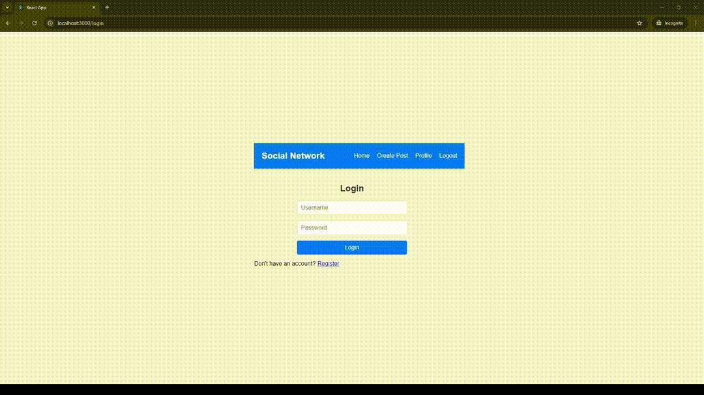

# **🌐 Social Network (MERN Stack) 🌐** 

## Preview

  
_A fully interactive social network with real-time updates and feed._

## Prerequisites

- **Node.js**: Install [Node.js](https://nodejs.org/) (v14 or higher).
- **MongoDB**: You need a MongoDB instance (local or cloud) to store user data.
- **npm**: Ensure npm is available (comes with Node.js).

## Building and Running

1. **Clone the repository**:

   ```bash
   git clone https://github.com/GitEagleY/MERN_SocialNetwork.git
   cd MERN_SocialNetwork
   ```

2. **Install server-side dependencies**:

   ```bash
   npm install
   ```

3. **Install client-side dependencies**:

   ```bash
   cd client
   npm install
   ```

4. **Set up environment variables**:
   Create a `.env` file in the root directory and add:

   ```bash
   JWT_SECRET=<your-secret-key>
   ```

5. **Run the development servers**:
   - Backend:
     ```bash
     node server.js
     ```
   - Frontend:
     ```bash
     cd client
     npm start
     ```

## Notes

### Generate a JWT Secret

- **Windows**:
  ```bash
  powershell -Command "Add-Type -AssemblyName System.Web; [System.Web.Security.Membership]::GeneratePassword(64,10)"
  ```
- **Unix (Linux/macOS)**:
  ```bash
  openssl rand -base64 32
  ```

### MongoDB Compass Connection

To connect your MongoDB database to MongoDB Compass, use the following connection string:

```
mongodb://localhost:27017
```


## Technologies Used

- **Frontend**: React, Material-UI (MUI), CSS
- **Backend**: Node.js, Express.js, MongoDB
- **Authentication**: JWT (JSON Web Tokens)

## Folder Structure

```
/client          # Contains frontend code for the application

/middleware      # Holds middleware functions that sit between incoming requests and the server logic, such as authentication

/models          # Contains the database schema and models (e.g., user, post) used to interact with the database

/routes          # Defines the API routes/endpoints for different features like users, posts, etc.

/server.js       # The main entry point for the backend server; handles initial server setup, middleware configuration, and routing

/.env            # Contains environment variables (e.g., database URL, secret keys, API keys); should not be committed to version control

```

## Future Enhancements

- Improve UI
- Expand profile customization options

## Contributions

Feel free to fork the repository, create a feature branch, and submit a pull request!
